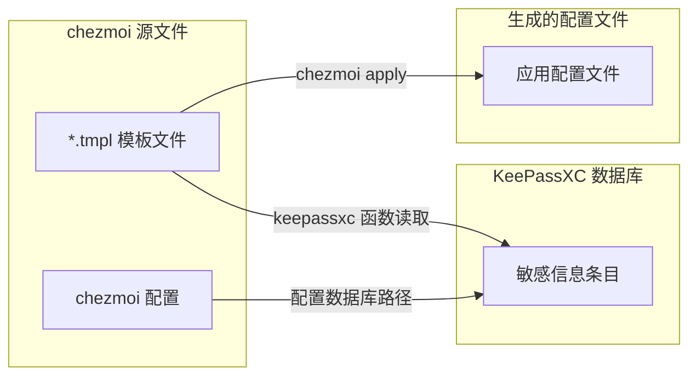

# chezmoi + KeePassXC Dotfiles 管理方案

使用 chezmoi 管理 dotfiles，通过 KeePassXC 安全存储和注入敏感信息（API keys、tokens、密码等），敏感文件用 age 加密后提交到仓库。本仓库使用 `.chezmoiroot`，源状态位于 `dotfiles/` 子目录。

## 核心特性

- **安全管理敏感信息**：API keys、tokens、密码存储在 KeePassXC 中，不提交明文到 git
- **跨机器同步**：模板在多台机器间同步，敏感信息本地管理
- **自动化部署**：一键安装依赖、配置 hooks、应用配置
- **敏感信息检测**：集成 gitleaks 与 CI 扫描，防止密钥泄露

## 工作流程



## 快速开始

### 1. 安装依赖

在仓库根目录执行（支持 Linux、macOS、Windows，自动检测包管理器）：

```bash
make install
```

可通过 `INSTALL_BIN` 指定二进制目录，默认 `~/.local/bin`：

```bash
make install INSTALL_BIN=~/bin
```

支持平台：Linux（apt/dnf/pacman/apk/zypper/xbps/nix 等）、macOS（Homebrew/MacPorts/Nix）、Windows（winget/Scoop/Chocolatey）。

### 2. 创建 KeePassXC 数据库和条目

使用脚本创建/编辑条目（数据库默认 `~/.config/keepassxc/chezmoi.kdbx`）：

```bash
make keepassxc-entry add    # 添加条目
make keepassxc-entry show    # 查看
make keepassxc-entry edit    # 编辑
make keepassxc-entry rm      # 删除
make keepassxc-entry ls      # 列表
make keepassxc-entry search  # 搜索
```

添加时需提供：条目路径（必填，支持 `Group/Entry` 层级）、Username/URL/Notes（可选）；密码由 keepassxc-cli 提示输入。

### 3. 配置 chezmoi（KeePassXC + age）

- **本机首次**：
  1. `make setup-age-keys` 生成 age 密钥并写入 `dotfiles/dot_config/chezmoi/chezmoi.toml.tmpl` 的 recipient。
  2. 执行一次 `chezmoi apply`，使 `chezmoi.toml.tmpl` 生效，之后 age 加密可用。
  3. 执行 `chezmoi add --encrypt ~/.config/keepassxc/chezmoi.kdbx`，源中会生成 `dotfiles/dot_config/keepassxc/chezmoi.kdbx.age`。

- **新机器**：
  将 age 私钥放到 `~/.config/chezmoi/age.txt`，在仓库根目录执行 `make bootstrap-chezmoi-config`，再执行 `chezmoi apply`。run_before 会先解密 kdbx，再应用其余配置。

### 4. 管理的配置一览

| 配置 | 说明 | 详见 |
|------|------|------|
| KeePassXC 数据库 | age 加密存放在 `dotfiles/dot_config/keepassxc/`，apply 时解密到 `~/.config/keepassxc/chezmoi.kdbx` | 见上文「配置 chezmoi」 |
| KeePassXC 应用配置 | `keepassxc.ini`：`chezmoi add ~/.config/keepassxc/keepassxc.ini` | — |
| Kubernetes kubeconfig | age 加密存放在 `dotfiles/private_dot_kube/config.age`，apply 时解密到 `~/.kube/config` | [docs/kubeconfig.md](docs/kubeconfig.md) |
| Cursor | settings.json、keybindings.json、snippets，按平台路径管理 | [docs/cursor.md](docs/cursor.md) |
| Claude Code | ~/.claude/settings.json，API token/URL 由 KeePassXC 注入 | [docs/claude.md](docs/claude.md) |

### 5. 模板与应用配置

在源目录创建 `*.tmpl` 模板，用 `keepassxc "条目名"` 读取 KeePassXC 条目，用 `.Password`、`.Username`、`.URL` 访问字段，用 `keepassxcAttribute "条目名" "属性名"` 读取自定义属性。条目名需与 KeePassXC 中完全一致（区分大小写）；层级路径如 `Internet/MyApp`。

示例（`dotfiles/dot_claude/settings.json.tmpl`）：

```json
{
  "env": {
    "ANTHROPIC_AUTH_TOKEN": "{{ (keepassxc \"Claude Code\").Password }}",
    "ANTHROPIC_BASE_URL": "{{ (keepassxc \"Claude Code\").URL }}"
  }
}
```

应用配置：

```bash
chezmoi apply
chezmoi apply ~/.config/app/config.json   # 仅应用指定文件
```

apply 时会提示 KeePassXC 数据库密码；生成的文件含真实敏感信息，由 chezmoi 管理，不宜长期手动修改。

## 常用命令

```bash
make help                # 查看所有 make target
make keepassxc-entry add # KeePassXC 条目增删改查（add|show|edit|rm|ls|search）
make test                # 运行测试
```

## 版本控制与安全

**可提交到 git**：模板（`*.tmpl`）、chezmoi 配置（`dotfiles/dot_config/chezmoi/chezmoi.toml.tmpl`）、脚本与工具配置、age 加密后的 kdbx（如 `dotfiles/dot_config/keepassxc/chezmoi.kdbx.age`）和 `dotfiles/private_dot_kube/config.age`。

**不提交**：KeePassXC 明文（`*.kdbx`）、age 私钥（`~/.config/chezmoi/age.txt`）、由 chezmoi apply 生成的含敏感信息的文件。

### 敏感信息检测

- **Pre-commit（gitleaks）**：提交前本地扫描，速度快；`make install` 已包含，或 `make install-gitleaks`、`make setup-hooks`。误报可用 `git commit --no-verify` 跳过。
- **GitHub Actions（TruffleHog）**：CI 深度扫描与历史扫描，配置见 `.github/workflows/secret-scanning.yml`。

两阶段组合使用：Gitleaks 本地即时反馈，TruffleHog 做 CI 与历史兜底。配置文件：`lefthook.yml`、`.gitleaks.toml`、`.github/workflows/secret-scanning.yml`。

## 高级用法

- **机器特定变量**：`.chezmoidata.toml` 中定义 `[data]`，模板中用 `{{ .email }}` 等。
- **覆盖 KeePassXC 数据库路径**：在 `~/.config/chezmoi/chezmoi.toml` 中设置 `[keepassxc] database = "/path/to/database.kdbx"`。
- **预览模板结果**：`chezmoi execute-template < dotfiles/dot_config/app/config.tmpl`（会提示 KeePassXC 密码，不写文件）。

## 注意事项

1. 需安装 `keepassxc-cli`，chezmoi 依赖其读取数据库。
2. 模板中的 KeePassXC 条目名须与数据库内完全一致（区分大小写）。
3. 子组条目使用完整路径，如 `Internet/MyApp`。
4. 每次 `chezmoi apply` 会提示数据库密码；可配合 KeePassXC 浏览器集成减少输入。
