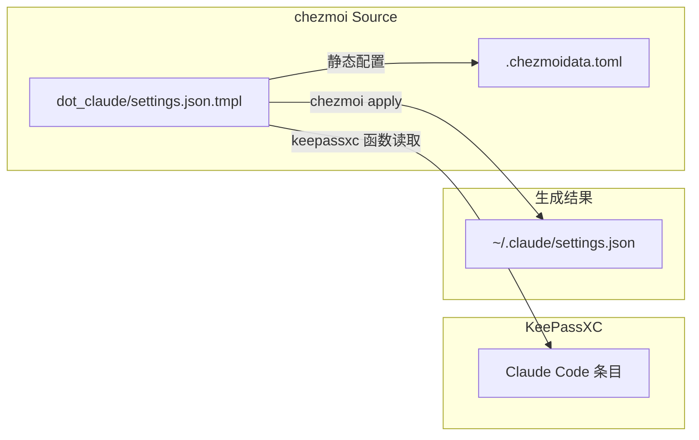

# Claude Code 配置的 chezmoi + KeePassXC 管理方案

## 架构流程



## 前置条件

- 已安装 `chezmoi` 和 `keepassxc-cli`
- KeePassXC 数据库文件路径已知（如 `~/.local/share/chezmoi.kdbx`）

### 使用 Makefile 安装依赖

支持 Linux、macOS、Windows 多平台，自动检测包管理器：

```bash
make install              # 安装 chezmoi 和 keepassxc-cli
make install-chezmoi      # 仅安装 chezmoi
make install-keepassxc-cli # 仅安装 keepassxc-cli
make keepassxc-entry [cmd] # KeePassXC 条目增删改查（add|show|edit|rm|ls|search）
make test                 # 运行测试
make help                 # 查看所有命令
```

**支持平台：**

- **Linux**：apt、dnf、pacman、apk、zypper、xbps-install、nix-env、snap；无包管理器时使用 chezmoi 官方安装脚本
- **macOS**：Homebrew、MacPorts、Nix
- **Windows**（MSYS2/Git Bash）：winget、Scoop、Chocolatey

可通过 `INSTALL_BIN` 指定 chezmoi 二进制安装目录，默认 `~/.local/bin`：

```bash
make install-chezmoi INSTALL_BIN=~/bin
```

- 在 KeePassXC 中预先创建好用于 Claude Code 的条目（见下文）

## 1. KeePassXC 条目结构

在 KeePassXC 中创建一个条目（建议命名为 `Claude Code` 或 `Anthropic API`），字段建议如下：

| 字段           | 对应环境变量          | 示例值                      |
| ------------ | ------------------- | ------------------------ |
| **Password** | `ANTHROPIC_AUTH_TOKEN` | 您的真实 API Key             |
| **URL**      | `ANTHROPIC_BASE_URL`   | `https://api.skyapi.org` |

**方式一：交互式脚本（推荐）**

```bash
make keepassxc-entry add         # 添加条目
./scripts/keepassxc-entry.sh add
./scripts/keepassxc-entry.sh show    # 查看
./scripts/keepassxc-entry.sh edit    # 编辑
./scripts/keepassxc-entry.sh rm      # 删除
./scripts/keepassxc-entry.sh ls      # 列表
./scripts/keepassxc-entry.sh search  # 搜索
./scripts/keepassxc-entry.sh --help  # 帮助
```

支持 add/show/edit/rm/ls/search。添加条目时：数据库路径（默认 `~/.local/share/chezmoi.kdbx`）、条目路径（必填，支持 `Group/Entry`）、Username/URL/Notes（可留空）。密码由 keepassxc-cli 原生提示。

**方式二：KeePassXC 图形界面**

1. 打开 KeePassXC，打开或新建数据库（如 `~/.local/share/chezmoi.kdbx`）
2. 在左侧分组中右键 → **添加新条目**（或 Ctrl+N）
3. 填写 **标题**：`Claude Code`（须与模板中的条目标题一致）
4. 在 **密码** 栏填入你的 API Key
5. 在 **URL** 栏填入 base URL（如 `https://api.skyapi.org`）
6. 保存（Ctrl+S）

若 base URL 需单独管理，可添加自定义属性 `base_url`：在条目编辑界面点击 **属性** → **添加**，名称填 `base_url`，值填 URL；模板中用 `keepassxcAttribute "Claude Code" "base_url"` 读取，此时可置空 URL 字段。**注意**：自定义属性仅支持通过图形界面添加，keepassxc-cli 暂不支持。

## 2. 文件结构

在 chezmoi 源目录 `~/.local/share/chezmoi/` 下创建：

```
~/.local/share/chezmoi/
├── dot_claude/
│   └── settings.json.tmpl    # Claude Code 配置模板
└── dot_config/
    └── chezmoi/
        └── chezmoi.toml.tmpl # chezmoi 自身配置（KeePassXC）
```

## 3. 模板内容

**dot_claude/settings.json.tmpl**：

```json
{
  "env": {
    "ANTHROPIC_AUTH_TOKEN": "{{ (keepassxc "Claude Code").Password }}",
    "ANTHROPIC_BASE_URL": "{{ (keepassxc "Claude Code").URL }}",
    "CLAUDE_CODE_DISABLE_NONESSENTIAL_TRAFFIC": 1
  },
  "permissions": {
    "allow": [],
    "deny": []
  }
}
```

若 base URL 使用自定义属性 `base_url`，则改为：

```
"ANTHROPIC_BASE_URL": "{{ keepassxcAttribute "Claude Code" "base_url" }}"
```

模板中的 `"Claude Code"` 需与 KeePassXC 中条目标题完全一致。如使用层级（如 `Internet/Claude Code`），按 KeePassXC 的路径格式填写。

## 4. KeePassXC 配置

`~/.config/chezmoi/chezmoi.toml` 由 `dot_config/chezmoi/chezmoi.toml.tmpl` 管理，使用 `{{ .chezmoi.homeDir }}` 实现跨机器可移植：

```toml
[keepassxc]
database = "{{ .chezmoi.homeDir }}/.local/share/chezmoi.kdbx"
```

若数据库无密码，可添加：

```toml
args = ["--no-password"]
prompt = false
```

## 5. 应用流程

**首次使用前，检查 KeePassXC 配置：**

```bash
make check-keepassxc
```

此命令会检查数据库和 `Claude Code` 条目是否存在。如果不存在，按提示使用 `make keepassxc-entry add` 创建。

**应用配置：**

```bash
# 首次或更新后应用配置
chezmoi apply

# 或只应用 .claude 相关
chezmoi apply ~/.claude/settings.json
```

应用时会提示输入 KeePassXC 数据库密码。应用后，`~/.claude/settings.json` 会包含从 KeePassXC 读取的真实 token 和 base URL，且该文件由 chezmoi 管理，不应手动长期修改。

## 6. 敏感信息与版本控制

- **可提交到 git**：`dot_claude/settings.json.tmpl`、`dot_config/chezmoi/chezmoi.toml.tmpl`（仅模板，使用 `{{ .chezmoi.homeDir }}` 无硬编码路径）
- **不提交**：KeePassXC 数据库文件

## 7. 可选：私有/忽略配置

若需覆盖 KeePassXC 数据库路径，可在 `~/.config/chezmoi/chezmoi.toml` 中设置，或使用 `.chezmoidata.toml` 提供机器特定变量。

## 注意事项

1. **keepassxc-cli**：需已安装 `keepassxc-cli`，chezmoi 依赖其读取数据库
2. **条目标题**：模板中的 `"Claude Code"` 必须与 KeePassXC 中条目标题一致（区分大小写）
3. **层级路径**：若条目在子组中，可能需要使用完整路径，如 `Internet/Claude Code`（取决于 keepassxc-cli 的解析方式）
4. **验证**：应用前可用 `chezmoi execute-template < dot_claude/settings.json.tmpl` 预览生成内容（会提示输入 KeePassXC 密码）
