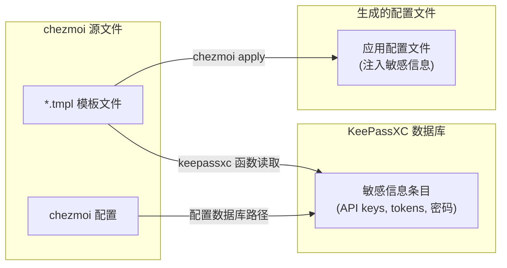

# chezmoi + KeePassXC Dotfiles 管理方案

使用 chezmoi 管理 dotfiles，通过 KeePassXC 安全存储和注入敏感信息（API keys、tokens、密码等）。

## 核心特性

- ✅ **安全管理敏感信息**：API keys、tokens、密码存储在 KeePassXC 中，不提交到 git
- ✅ **跨机器同步**：dotfiles 模板可在多台机器间同步，敏感信息本地管理
- ✅ **自动化部署**：一键安装依赖、配置 hooks、应用配置
- ✅ **敏感信息检测**：集成 gitleaks 防止意外提交密钥

## 工作流程



## 快速开始

### 1. 安装依赖

使用 Makefile 一键安装所有依赖：

支持 Linux、macOS、Windows 多平台，自动检测包管理器：

```bash
make install              # 安装所有依赖并配置 hooks
make install-chezmoi      # 仅安装 chezmoi
make install-keepassxc-cli # 仅安装 keepassxc-cli
make install-lefthook     # 仅安装 lefthook
make install-gitleaks     # 仅安装 gitleaks
make setup-hooks          # 配置 git hooks（需先安装 lefthook）
make keepassxc-entry [cmd] # KeePassXC 条目增删改查（add|show|edit|rm|ls|search）
make test                 # 运行测试
make help                 # 查看所有命令
```

**支持平台：**

- **Linux**：apt、dnf、pacman、apk、zypper、xbps-install、nix-env、snap；无包管理器时使用 chezmoi 官方安装脚本
- **macOS**：Homebrew、MacPorts、Nix
- **Windows**（MSYS2/Git Bash）：winget、Scoop、Chocolatey

可通过 `INSTALL_BIN` 指定二进制安装目录，默认 `~/.local/bin`：

```bash
make install-chezmoi INSTALL_BIN=~/bin
```

### 2. 创建 KeePassXC 数据库和条目

在 KeePassXC 中创建条目存储敏感信息（API keys、tokens、密码等）。

#### 方式一：交互式脚本（推荐）

```bash
make keepassxc-entry add         # 添加条目
./scripts/keepassxc-entry.sh add
./scripts/keepassxc-entry.sh show    # 查看
./scripts/keepassxc-entry.sh edit    # 编辑
./scripts/keepassxc-entry.sh rm      # 删除
./scripts/keepassxc-entry.sh ls      # 列表
./scripts/keepassxc-entry.sh search  # 搜索
./scripts/keepassxc-entry.sh --help  # 帮助
```

脚本支持完整的 CRUD 操作。添加条目时：
- 数据库路径（默认 `~/.local/share/chezmoi.kdbx`）
- 条目路径（必填，支持 `Group/Entry` 层级）
- Username/URL/Notes（可选）
- 密码由 keepassxc-cli 原生提示

#### 方式二：KeePassXC 图形界面

1. 打开 KeePassXC，打开或新建数据库（如 `~/.local/share/chezmoi.kdbx`）
2. 在左侧分组中右键 → **添加新条目**（或 Ctrl+N）
3. 填写 **标题**、**用户名**、**密码**、**URL** 等字段
4. 保存（Ctrl+S）

**自定义属性**：若需存储额外字段（如 `base_url`），在条目编辑界面点击 **属性** → **添加**。模板中用 `keepassxcAttribute "条目名" "属性名"` 读取。**注意**：自定义属性仅支持通过图形界面添加，keepassxc-cli 暂不支持。

### 3. 配置 chezmoi 使用 KeePassXC

创建 `dot_config/chezmoi/chezmoi.toml.tmpl` 配置 KeePassXC 数据库路径：

```toml
[keepassxc]
database = "{{ .chezmoi.homeDir }}/.local/share/chezmoi.kdbx"
```

使用 `{{ .chezmoi.homeDir }}` 实现跨机器可移植。若数据库无密码，可添加：

```toml
args = ["--no-password"]
prompt = false
```

### 4. 创建配置模板

在 chezmoi 源目录创建模板文件，使用 `keepassxc` 函数读取敏感信息。

#### 示例：Claude Code 配置

创建 `dot_claude/settings.json.tmpl`：

```json
{
  "env": {
    "ANTHROPIC_AUTH_TOKEN": "{{ (keepassxc "Claude Code").Password }}",
    "ANTHROPIC_BASE_URL": "{{ (keepassxc "Claude Code").URL }}",
    "CLAUDE_CODE_DISABLE_NONESSENTIAL_TRAFFIC": 1
  },
  "permissions": {
    "allow": [],
    "deny": []
  }
}
```

**模板语法说明**：
- `keepassxc "条目名"`：读取 KeePassXC 条目
- `.Password`、`.Username`、`.URL`：访问条目字段
- `keepassxcAttribute "条目名" "属性名"`：读取自定义属性

条目名需与 KeePassXC 中完全一致（区分大小写）。如使用层级（如 `Internet/MyApp`），按 KeePassXC 路径格式填写。

### 5. 应用配置

**首次使用前检查配置**：

```bash
make check-keepassxc  # 检查数据库和条目
```

**应用配置**：

```bash
chezmoi apply         # 应用所有配置
chezmoi apply ~/.config/app/config.json  # 应用特定文件
```

应用时会提示输入 KeePassXC 数据库密码。生成的配置文件包含从 KeePassXC 读取的真实敏感信息，由 chezmoi 管理，不应手动长期修改。

## 版本控制与安全

### 可提交到 git

- ✅ 模板文件（`*.tmpl`）：不包含实际敏感信息
- ✅ chezmoi 配置（`dot_config/chezmoi/chezmoi.toml.tmpl`）：使用 `{{ .chezmoi.homeDir }}` 无硬编码路径
- ✅ 脚本和工具配置

### 不提交到 git

- ❌ KeePassXC 数据库文件（`*.kdbx`）
- ❌ 生成的配置文件（由 chezmoi apply 生成）

### Git Hooks 管理

仓库使用 [lefthook](https://github.com/evilmartians/lefthook) 管理 git hooks，并集成 [gitleaks](https://github.com/gitleaks/gitleaks) 检测敏感信息。

**Pre-commit Hook**：使用 gitleaks 自动检测敏感信息

- **gitleaks**：业界标准的密钥扫描工具（24,400+ stars）
- 内置 150+ 检测规则：API key、密码、私钥、token 等
- 支持自定义规则（`.gitleaks.toml`）和白名单（`.gitleaksignore`）
- 提交时自动运行，发现敏感信息会阻止提交
- 如遇误报，可使用 `git commit --no-verify` 跳过检查

**安装和配置**：

```bash
make install           # 安装所有依赖（包含 gitleaks）
make install-gitleaks  # 仅安装 gitleaks
make setup-hooks       # 配置 git hooks
```

或手动执行：

```bash
lefthook install         # 安装 hooks 到 .git/hooks/
lefthook run pre-commit  # 手动运行 pre-commit 检查
gitleaks git --pre-commit # 单独运行 gitleaks
```

**配置文件**：

- `lefthook.yml`：hook 管理配置
- `.gitleaks.toml`：gitleaks 自定义规则和白名单

## 高级用法

### 机器特定配置

使用 `.chezmoidata.toml` 提供机器特定变量：

```toml
[data]
email = "user@example.com"
hostname = "workstation"
```

在模板中使用：`{{ .email }}`

### 覆盖 KeePassXC 数据库路径

在 `~/.config/chezmoi/chezmoi.toml` 中覆盖：

```toml
[keepassxc]
database = "/custom/path/to/database.kdbx"
```

### 预览模板生成结果

```bash
chezmoi execute-template < dot_config/app/config.tmpl
```

会提示输入 KeePassXC 密码并显示生成内容，但不写入文件。

## 注意事项

1. **keepassxc-cli 依赖**：chezmoi 依赖 `keepassxc-cli` 读取数据库，确保已安装
2. **条目名称匹配**：模板中的条目名必须与 KeePassXC 中完全一致（区分大小写）
3. **层级路径**：若条目在子组中，使用完整路径，如 `Internet/MyApp`
4. **密码提示**：每次 `chezmoi apply` 会提示输入数据库密码，可配置 KeePassXC 浏览器集成避免重复输入
