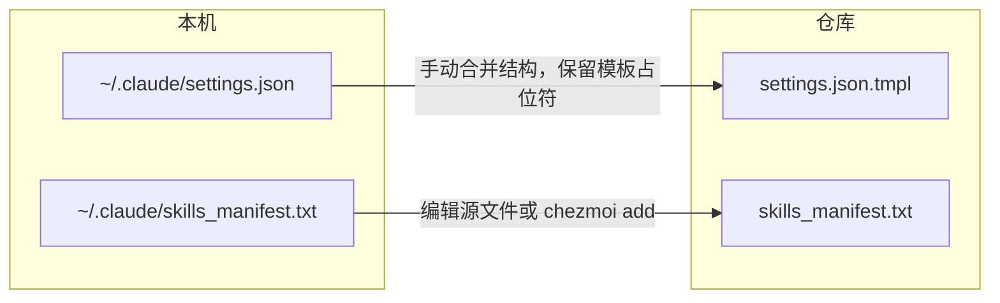

# 将本机 Claude 配置变更同步回仓库

## 背景

仓库中 Claude 相关源文件与本地路径对应关系：

| 本机路径 | 仓库源文件 | 说明 |
|----------|------------|------|
| `~/.claude/settings.json` | [dotfiles/dot_claude/settings.json.tmpl](dotfiles/dot_claude/settings.json.tmpl) | 模板生成，含 KeePassXC 占位符 |
| `~/.claude/skills_manifest.txt` | [dotfiles/dot_claude/skills_manifest.txt](dotfiles/dot_claude/skills_manifest.txt) | 普通文件，apply 时复制 |
| `~/.claude/skills/` | 仅 [dotfiles/dot_claude/skills/.gitkeep](dotfiles/dot_claude/skills/.gitkeep)，实际 skill 由清单 + run_after 安装 | 不同步回仓库 |

**重要**：`settings.json` 由模板生成，本机文件里是**真实 token/URL**，不能直接把本机文件 add 进仓库，否则会泄露敏感信息。

---

## 1. 同步 `settings.json` 的变更（需手动合并）

**不要**执行 `chezmoi add ~/.claude/settings.json`，否则会把明文 token 写进仓库。

**正确做法**：

1. 打开本机 `~/.claude/settings.json`，确认你改动的部分（例如新增的 `env` 键、`permissions.allow`/`deny`、其它顶层键）。
2. 在仓库中编辑 `dotfiles/dot_claude/settings.json.tmpl`，把**结构/键/非敏感值**按本机版本更新。
3. **必须保留**敏感字段的模板写法，不能改成真实值：
   - `ANTHROPIC_AUTH_TOKEN` → 保持 `{{ (keepassxc "Claude Code").Password }}`
   - `ANTHROPIC_BASE_URL` → 保持 `{{ (keepassxc "Claude Code").URL }}`
4. 若有新增的**非敏感** env 变量，在模板里直接写死值；若是敏感信息，需在 KeePassXC 中新增条目并在模板里用 `keepassxc` 引用（或先不纳入仓库）。
5. 保存后在本机执行 `chezmoi apply` 验证生成结果是否与预期一致。

---

## 2. 同步 `skills_manifest.txt` 的变更

若本机修改了 `~/.claude/skills_manifest.txt`（或通过 add-skill 装了新 skill 并希望纳入清单）：

- **方式 A**：直接编辑仓库中的 `dotfiles/dot_claude/skills_manifest.txt`，把本机清单里新增/修改的行抄过去（格式：每行 `owner/repo [--skill name]`）。
- **方式 B**：若本机清单已是唯一真相且无敏感内容，可在仓库根执行：

```bash
chezmoi add ~/.claude/skills_manifest.txt
```

会用本机文件覆盖源文件，然后 `chezmoi apply` 会再把它写回本机并触发 run_after 安装 skills。

---

## 3. 其它 Claude 相关文件

- **skills 目录**：仓库只维护清单和 run_after 脚本，不把 `~/.claude/skills/` 下具体 skill 内容纳入仓库。本机新装的 skill 只需在 `skills_manifest.txt` 里补一行并同步（见上）。
- **run_after 脚本**：`dotfiles/.chezmoiscripts/run_after_10-install-claude-skills.sh` 一般不需因「本机配置改了」而改；只有要改安装逻辑时才改仓库里的脚本。

---

## 4. 建议文档补充（可选）

在 [docs/claude.md](claude.md) 的「修改流程」小节可增加一段「本机已改配置如何回写仓库」：

- 强调 **settings.json** 禁止 `chezmoi add`，必须手动合并到 `settings.json.tmpl` 并保留 keepassxc 占位符。
- 说明 **skills_manifest.txt** 可编辑源文件或使用 `chezmoi add` 覆盖。

---

## 流程小结



完成后执行一次 `chezmoi apply` 确认无 diff，再提交并推送仓库变更。
