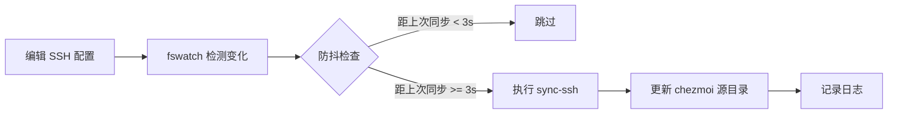

# SSH Config Auto-Sync Watcher

自动监控 SSH 配置文件变化并同步到 chezmoi 仓库的后台服务。

## 功能特性

- 🔍 实时监控 SSH 配置文件变化
- 🔄 自动同步到 chezmoi 源目录
- ⏱️ 防抖机制避免频繁同步（3秒间隔）
- 📝 详细的日志记录
- 🚀 作为系统服务运行（macOS LaunchAgent / Linux systemd）

## 监控的文件

- `~/.ssh/config` - 主配置文件
- `~/.ssh/config.d/*.sconf` - 模块化配置文件
- `~/.ssh/bin/*` - 辅助脚本

## 安装依赖

### macOS
```bash
brew install fswatch
```

### Linux
```bash
# Ubuntu/Debian
sudo apt install fswatch

# Fedora
sudo dnf install fswatch

# Arch Linux
sudo pacman -S fswatch
```

## 使用方法

### 前台运行（测试用）

直接在终端运行，可以看到实时日志：

```bash
make watch-ssh
```

或者：

```bash
./scripts/watch-ssh-config.sh
```

按 `Ctrl+C` 停止。

### 后台服务（推荐）

#### 安装服务

```bash
make install-ssh-watcher
```

这会：
1. 检查并安装 `fswatch`（如果需要）
2. 创建系统服务配置
3. 启动后台服务

#### 查看状态

```bash
make status-ssh-watcher
```

#### 查看日志

```bash
make logs-ssh-watcher
```

**macOS 日志位置：**
- 标准输出：`~/Library/Logs/ssh-watcher.log`
- 错误输出：`~/Library/Logs/ssh-watcher.error.log`

**Linux 日志查看：**
```bash
journalctl --user -u ssh-watcher -f
```

#### 卸载服务

```bash
make uninstall-ssh-watcher
```

## 工作原理



### 防抖机制

为避免频繁编辑导致的多次同步，watcher 实现了 3 秒的防抖间隔：

- 检测到文件变化后立即同步
- 3 秒内的后续变化会被忽略
- 3 秒后的变化会触发新的同步

这样可以避免：
- Vim 保存时的临时文件触发
- 快速连续编辑导致的多次同步
- 不必要的 git 操作

### 文件过滤

Watcher 只监控相关文件，忽略：
- 编辑器临时文件（`~`, `.swp`, `.tmp`）
- 非配置文件
- 其他无关文件

## 测试

### 1. 安装并启动服务

```bash
make install-ssh-watcher
```

### 2. 编辑配置文件

```bash
vim ~/.ssh/config.d/personal.sconf
# 做一些修改并保存
```

### 3. 查看日志

```bash
make logs-ssh-watcher
```

你应该看到类似输出：

```
[2026-03-18 17:30:15] Change detected: /Users/you/.ssh/config.d/personal.sconf
[2026-03-18 17:30:15] Running sync...
[2026-03-18 17:30:16] Sync completed successfully
[2026-03-18 17:30:16]   Success: 3 section(s)
```

### 4. 验证同步

```bash
cd ~/.local/share/chezmoi
git status
# 应该看到 dotfiles/private_dot_ssh/ 下的文件已更新
```

## 故障排查

### 服务未运行

**macOS:**
```bash
launchctl list | grep ssh-watcher
# 如果没有输出，说明服务未运行
make install-ssh-watcher
```

**Linux:**
```bash
systemctl --user status ssh-watcher
# 查看详细状态
```

### fswatch 未找到

```bash
# macOS
brew install fswatch

# Linux
sudo apt install fswatch  # Ubuntu/Debian
```

### 同步失败

查看详细错误日志：

**macOS:**
```bash
tail -50 ~/Library/Logs/ssh-watcher.error.log
```

**Linux:**
```bash
journalctl --user -u ssh-watcher -n 50
```

常见问题：
- chezmoi 未配置 age 密钥
- 权限问题
- 磁盘空间不足

### 手动测试同步

```bash
# 直接运行同步脚本
./scripts/sync-ssh-config.sh
```

## 性能影响

- CPU 占用：几乎为 0（事件驱动）
- 内存占用：< 10MB
- 磁盘 I/O：仅在文件变化时触发
- 网络：不涉及网络操作（仅本地同步）

## 安全考虑

1. **加密存储**：`.sconf` 文件使用 age 加密后才同步到仓库
2. **本地操作**：所有操作都在本地进行，不涉及网络传输
3. **权限隔离**：服务以用户身份运行，不需要 root 权限
4. **日志安全**：日志文件权限为 600，仅用户可读

## 与其他工具集成

### 配合 Git 自动提交

如果你想在同步后自动提交到 git，可以修改 `sync-ssh-config.sh`：

```bash
# 在脚本末尾添加
if [ $FAIL_COUNT -eq 0 ]; then
  cd "$REPO_ROOT"
  if ! git diff --quiet dotfiles/private_dot_ssh/; then
    git add dotfiles/private_dot_ssh/
    git commit -m "auto: update SSH configuration"
    # git push  # 如果需要自动推送
  fi
fi
```

### 配合通知

**macOS 通知：**
```bash
# 在 sync_changes 函数中添加
osascript -e 'display notification "SSH config synced" with title "Chezmoi"'
```

**Linux 通知：**
```bash
notify-send "Chezmoi" "SSH config synced"
```

## 命令速查

| 命令 | 说明 |
|------|------|
| `make watch-ssh` | 前台运行 watcher |
| `make install-ssh-watcher` | 安装后台服务 |
| `make uninstall-ssh-watcher` | 卸载后台服务 |
| `make status-ssh-watcher` | 查看服务状态 |
| `make logs-ssh-watcher` | 查看服务日志 |
| `make sync-ssh` | 手动同步一次 |

## 相关文件

- `scripts/watch-ssh-config.sh` - 文件监控脚本
- `scripts/install-ssh-watcher.sh` - 服务安装脚本
- `scripts/sync-ssh-config.sh` - 同步脚本
- `make/ssh.mk` - Makefile 目标定义
- `~/Library/LaunchAgents/com.chezmoi.ssh-watcher.plist` - macOS 服务配置
- `~/.config/systemd/user/ssh-watcher.service` - Linux 服务配置
