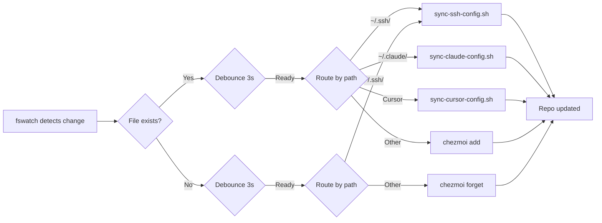

# 文件监控服务

后台服务，自动检测 chezmoi 管理的文件变化并同步到仓库。基于 [fswatch](https://github.com/emcrisostomo/fswatch) 实现，支持 macOS LaunchAgent 和 Linux systemd。

## 安装

```bash
make install-chezmoi-watcher
```

安装过程会自动：
1. 检测并安装 `fswatch`（macOS 通过 Homebrew）
2. 创建后台服务配置
3. 启动服务

## 监控范围

服务通过 `chezmoi managed` 自动发现所有被管理的文件，提取目录列表后监控。典型的监控目录包括：

- `~/.ssh`（config、config.d/、bin/）
- `~/.claude`
- `~/.config/chezmoi`、`~/.config/keepassxc`
- `~/.kube`
- Cursor 配置目录（按平台不同）

新增 chezmoi 管理的文件会在下次服务启动时自动纳入监控。

## 智能路由

检测到文件变化后，服务根据文件路径选择同步方式：

| 文件路径 | 同步方式 | 说明 |
|---------|---------|------|
| `~/.ssh/` | `sync-ssh-config.sh` | 自动使用 `--encrypt` 处理 .sconf 文件 |
| `~/.claude/` | `sync-claude-config.sh` | 原样拷回 settings.json / skills_manifest |
| Cursor 配置 | `sync-cursor-config.sh` | 保留模板占位符 |
| 其他文件 | `chezmoi add` | 通用处理 |

## 文件删除处理

删除本地文件时，服务会自动清理 chezmoi 源中对应的文件：

- **SSH 文件** -- 触发 `sync-ssh-config.sh`，自动检测并移除源目录中不再存在的 `.sconf.age` 文件
- **其他文件** -- 通过 `chezmoi forget` 从 chezmoi 管理中移除

## 防抖机制

为避免频繁编辑触发多次同步，服务实现了 3 秒防抖间隔。检测到变化后立即同步，3 秒内的后续变化会被忽略。编辑器临时文件（`~`、`.swp`、`.tmp`）被自动过滤。

## 服务管理

| 命令 | 说明 |
|------|------|
| `make install-chezmoi-watcher` | 安装并启动后台服务 |
| `make status-chezmoi-watcher` | 查看服务状态 |
| `make logs-chezmoi-watcher` | 查看服务日志 |
| `make uninstall-chezmoi-watcher` | 停止并卸载服务 |
| `make watch-chezmoi` | 前台运行（调试用） |

### 日志位置

**macOS：**
- `~/Library/Logs/chezmoi-watcher.log`
- `~/Library/Logs/chezmoi-watcher.error.log`

**Linux：**
```bash
journalctl --user -u chezmoi-watcher -f
```

## 工作原理



## 故障排查

**服务未运行：**
```bash
make status-chezmoi-watcher    # 查看状态
make install-chezmoi-watcher   # 重新安装
```

**fswatch 未安装：**
```bash
brew install fswatch           # macOS
sudo apt install fswatch       # Ubuntu/Debian
```

**同步失败：**
```bash
make logs-chezmoi-watcher      # 查看日志定位错误
./scripts/sync-ssh-config.sh   # 手动运行同步脚本排查
```

## 相关文件

- `scripts/watch-chezmoi-files.sh` -- 文件监控脚本
- `scripts/install-chezmoi-watcher.sh` -- 服务安装脚本
- `make/watcher.mk` -- Makefile 目标定义
